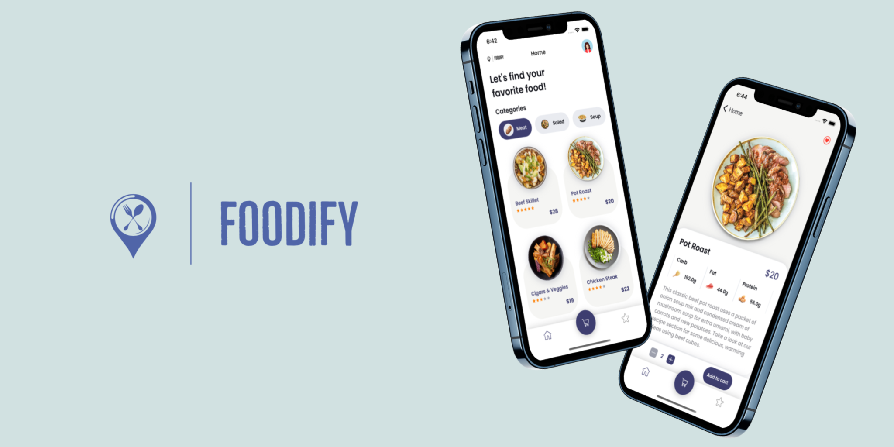
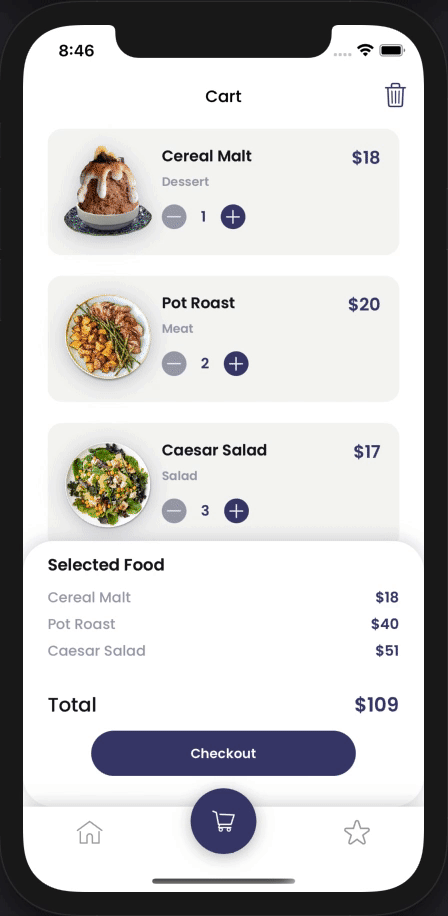

<h1 align="center">
  Foodify
</h1>

<div align="center">
  
</div>

## Table of Contents
- <a href="#about">About</a>
- <a href="#project-tech-stack">Project Tech Stack</a>
- <a href="#backend-application">Backend Application</a>
- <a href="#some-highlighted-things">Some Highlighted Things</a>
- <a href="#previews">Previews</a>
- <a href="#license">License</a>

## About
**Foodify** is a an application that aims users to find and order their favorite food. Users can filter products by categories and navigate product detail. In product detail page, users can see price, ingredients and short description of selected food. Also, in detail page, users can add the product to their favorite list and add any number of products to the cart.

In cart screen, users can check the price that equal to the number of products they want or they can empty the cart. If they want to continue, they will navigate to *demo* payment screen. In the payment screen, users will enter their order and payment information and finally successfully complete the order.

## Project Tech Stack
- Xcode: Version 12.4 (12D4e)
- Language: Swift 5.3.2
- Minimum iOS Version: 14.4
- Design Pattern: MVVM
- Dependenct Manager: Swift Package Manager
- Dependencies: **Alamofire, Kingfisher**

## Backend Application
This applications's Backend services are completely made by me and can be viewed in this [link](https://github.com/samedbcr/foodify-app/tree/main/restaurant-app-backend). This application is made as a RESTful API and it includes 4 services in total.
### Used Technologies in Backend Application
- Node.js and Express.js
- PostgreSQL as a DBMS
- Heroku in order to deploy Express app and store PostgreSQL into it
- AWS S3 service in order to store objects (images etc.)

## Some Highlighted Things
- No storyboard. 100% programmatic UI
- Organized folder structure
- Reusable views (components, cells etc.)
- API Module as a network (model-service) layer
- Unit Tests
- Empty state views
- Custom alerts
- Activity indicators
- Image cache mechanism via Kingfisher
- Fits perfect small or big device sizes

## Previews
| Home Screen | Detail Screen | Cart Screen |
| --- | --- | --- |
|  |  |  |
| Payment Screen | Favorite Screen | --- |
|  |  |

## License
```
Copyright (c) 2021 Samed Bicer

Permission is hereby granted, free of charge, to any person obtaining a copy
of this software and associated documentation files (the "Software"), to deal
in the Software without restriction, including without limitation the rights
to use, copy, modify, merge, publish, distribute, sublicense, and/or sell
copies of the Software, and to permit persons to whom the Software is
furnished to do so, subject to the following conditions:

The above copyright notice and this permission notice shall be included in all
copies or substantial portions of the Software.

THE SOFTWARE IS PROVIDED "AS IS", WITHOUT WARRANTY OF ANY KIND, EXPRESS OR
IMPLIED, INCLUDING BUT NOT LIMITED TO THE WARRANTIES OF MERCHANTABILITY,
FITNESS FOR A PARTICULAR PURPOSE AND NONINFRINGEMENT. IN NO EVENT SHALL THE
AUTHORS OR COPYRIGHT HOLDERS BE LIABLE FOR ANY CLAIM, DAMAGES OR OTHER
LIABILITY, WHETHER IN AN ACTION OF CONTRACT, TORT OR OTHERWISE, ARISING FROM,
OUT OF OR IN CONNECTION WITH THE SOFTWARE OR THE USE OR OTHER DEALINGS IN THE
SOFTWARE.
```